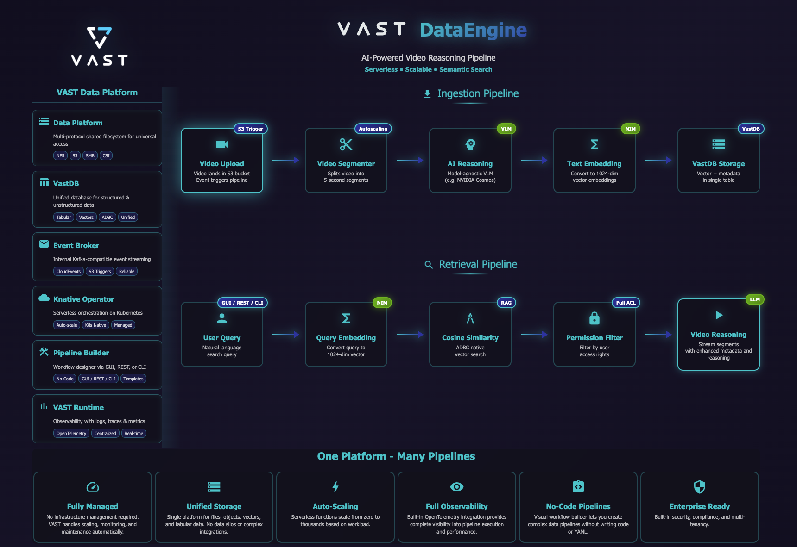

# VAST DataEngine - Video Reasoning Lab

Full overview: How to Deploy and Manage the Video Reasoning Lab system powered by VAST DataEngine.  

###### This is **NOT** an AI generated README. All steps here are mandatory to deploy the entire Demo.  

## Overview

The system has two main parts:
1. **Backend/Frontend** (Kubernetes) - User interface and API
2. **Ingest Pipeline** (VAST DataEngine) - Serverless video processing functions

---

## Key Features

### 1. Configurable Video Analysis Prompts (Cosmos VLM)

The `video-reasoner` function uses NVIDIA Cosmos VLM for video understanding. The analysis prompt can be configured per use case by setting the `scenario` key in the ingest secret.

**Available scenarios:**
| Scenario | Use Case |
|----------|----------|
| `surveillance` | Security cameras, safety monitoring (default) |
| `traffic` | Traffic cameras, vehicle detection, violations |
| `nhl` | Hockey game analysis, plays, penalties |
| `sports` | General sports footage analysis |
| `retail` | Store cameras, customer behavior, theft detection |
| `warehouse` | Industrial safety, forklift operations, PPE compliance |
| `nyc_control` | Urban command & control, license plates, anomalies |
| `general` | Generic video description |

**To change the scenario**, edit `ingest/vde-video-ingest-secret-template.yaml`:
```yaml
scenario: traffic  # Change to your use case
```

**To add a custom scenario**, edit `ingest/video-reasoner/common/prompts.py` and add your prompt to `SCENARIO_PROMPTS`.

---

### 2. Dynamic Metadata Filters

The system supports customizable metadata fields that flow through the entire pipeline:

**Current metadata fields:**
- `camera_id` - Camera identifier (e.g., "cam-01", "intersection-5th-ave")
- `capture_type` - Type of capture (e.g., "traffic", "streets", "crowds", "malls")
- `neighborhood` - Location/area (e.g., "manhattan", "downtown", "warehouse-a")

**How it works:**
1. **Ingest**: Metadata is set when uploading videos (via GUI upload or streaming service)
2. **Pipeline**: Metadata propagates through all functions (segmenter → reasoner → embedder → writer)
3. **VastDB**: Stored as columns alongside vectors and reasoning content
4. **Backend**: Auto-discovers available metadata columns dynamically from VastDB schema
5. **Frontend**: Displays discovered filters as dropdowns with actual values from the database

**To add custom metadata fields:**
1. Add the field to `ingest/*/common/models.py` (all functions)
2. Pass the field through each function's handler
3. Add to VastDB schema in `vastdb-writer/common/vastdb_client.py`
4. Backend will auto-discover the new column on next restart

---

### 3. Advanced LLM & Search Settings (GUI)

The GUI provides fine-grained control over search and LLM behavior via **Settings → Advanced LLM Settings**:

| Setting | Description | Options | Default |
|---------|-------------|---------|---------|
| **LLM Analysis Count** | Number of top results sent to LLM for synthesis | 3, 5, 10 | 3 |
| **Max Search Results** | Maximum video segments returned from search | 5, 10, 15 | 15 |
| **Minimum Similarity** | Threshold for vector similarity (lower = broader) | 0.1 - 0.8 slider | 0.1 |

Settings are persisted in browser localStorage and apply to all subsequent searches.

---

### 4. Custom LLM System Prompt (GUI)

The LLM system prompt (used for synthesizing search results) can be customized via **Settings → System Prompt**:

- **Default prompt**: Built into the frontend, used when no custom prompt is set
- **Custom prompt**: Override via the settings dialog - persisted in localStorage
- **Reset**: Return to default at any time

This allows tailoring the LLM response style without backend redeployment.

---

### 5. Time-Based Filtering

Search results can be filtered by time:
- **Presets**: Last 5 min, 15 min, 1 hour, 24 hours, 1 week
- **Custom Date**: Select specific date/time range with picker

Time filter applies to `upload_timestamp` column in VastDB.

---

### 6. Live Video Streaming Capture

The **video-streaming** service captures live YouTube streams and uploads segments to S3:
- Access via GUI → Settings → "Start Video Stream"
- Configure: YouTube URL, S3 credentials, segment duration
- Set metadata: `camera_id`, `capture_type`, `neighborhood` (optional)
- Segments automatically trigger the ingest pipeline

---

### 7. MP4 Video Format Requirement

**Important:** NVIDIA Cosmos Reason VLM requires MP4 (H.264) format. The system:
- Restricts GUI uploads to MP4 only
- Automatically converts non-MP4 formats during segmentation (if uploaded via CLI/tools)

---

### 8. User Authentication

The system authenticates users against VAST cluster credentials.

**Steps to make Authentication work**
1. VMS > Administrators > Administrative Roles
2. Create New Role > Provide Name 'read-only' > Choose Read-only (View) Permissions > Create
3. VMS > Administrators > Managers > Create
4. Create 'vssadmin' manager > Provide Password > Uncheck 'Password is temporary' Attach to 'read-only' Role

**Add these creda to the Backend Secret:**
**Location:** `retrieval/k8s/backend-secret.yaml`
```yaml
# vssadmin Credentials (for authenticating users via VAST API)
vast_admin_username: "vssadmin"       # vssadmin user (readonly)
vast_admin_password: "password"
```
- The admin credentials are only used server-side for user lookups, never exposed to clients

**How it works:**
1. User enters: **Username**, **S3 Secret Key**, and **VAST Host** (VMS IP) in the login screen
2. Backend uses a **master admin account** to query the VAST API
3. Backend verifies the user exists and validates their S3 secret key
4. On success, an internal JWT token is issued for the session

**Supported user providers:**
- Local VAST users
- Active Directory (AD)
- LDAP

Users authenticate with their **username + S3 secret key** (not their password). The S3 secret key is obtained from VAST user management.

---

## Pipeline Flow Diagram



---

## Prerequisites

- `kubectl` configured for your cluster
- Access to VAST DataEngine UI / CLI
- Cluster name (Any name you pick - e.g., `v1234`) 
- S3 buckets: `video-chunks` and `video-chunks-segments` created
- VastDB database bucket: `processed-videos-db` created
- NVIDIA COSMOS Modelo Endpoint & NIM Endpoints with API key for embeddings and LLM models

---

## Deployment Flow

Follow these steps in order:

1. **Part 1: Configuration** - Review and configure all secrets and images
2. **Part 2: Deploy Backend & Frontend** - Deploy Kubernetes services
3. **Part 3: Deploy Ingest Pipeline** - Create DataEngine pipeline using UI / CLI
4. **Part 4: Testing** - Test the complete system

---

## Part 1: Configuration

### Step 1.1: Review and Configure Backend Secret

**Location:** `retrieval/k8s/backend-secret.yaml`

**Required configuration:**
- **VastDB**: Database credentials and connection info
  - `vdb_endpoint` - VastDB endpoint URL [ From QueryEngine Vippool ]
  - `vdb_bucket`, `vdb_schema`, `vdb_collection` - Database path
  - `vdb_access_key`, `vdb_secret_key` - Credentials
- **S3**: Object storage credentials and buckets
  - `s3_endpoint` - S3 endpoint URL
  - `s3_upload_bucket`, `s3_segments_bucket` - Bucket names
  - `s3_access_key`, `s3_secret_key` - Credentials
- **NVIDIA API**: NIM embeddings and LLM API keys
  - `nvidia_api_key` - NVIDIA API key
  - `embedding_model` - Embedding model name - [ Tested with `nvidia/nv-embedqa-e5-v5` ]
  - `llm_model_name` - LLM model - [ Tested with `meta/llama-3.1-8b-instruct` ]
- **LLM Settings**: Model name, timeouts, parameters

**Edit the file with your credentials:**
```bash
cd retrieval/k8s
# Edit backend-secret.yaml with your configuration
vim backend-secret.yaml
```

### Step 1.2: Verify Docker Images

**Backend/Frontend images are prebuilt:**
- `vastdatasolutions/vde-video-backend:v1`
- `vastdatasolutions/vde-video-frontend:v1`
- `vastdatasolutions/vde-video-streaming:v1`

**If you need to rebuild and push to a different registry:**  
**NOTE: these images are static docker servers, not a 'vast dataengine' functions**
```bash
# Backend
cd retrieval/< video-backend / frontend >
docker build -t <your-registry>/vde-video-backend:<tag> . --platform linux/amd64
docker push <your-registry>/vde-video-backend:<tag>
```
Then update the image references in `backend-deployment.yaml` and `frontend-deployment.yaml`.

### Step 1.3: Review Ingest Secret

**Location:** `ingest/vde-video-ingest-secret-template.yaml`

**Required configuration:**
- **S3**: Upload bucket credentials
- **Cosmos**: AI model server credentials (host, port, username, password)
- **NVIDIA NIM**: Embedding model API keys
- **VastDB**: Database credentials
- **Video Processing**: Segment duration, codec, format

**Edit the file with your credentials:**
```bash
# Edit ingest secret
vim ingest/vde-video-ingest-secret-template.yaml
```

---

## Part 2: Deploy Backend & Frontend

Now that all configuration is ready, deploy the backend and frontend services.

### Deployment Steps

1. **Navigate to the k8s directory:**
```bash
cd retrieval/k8s
```

2. **Run the deployment script with your CLUSTER_NAME:**
Example:
```bash
./QUICK_DEPLOY.sh v1234
```

3. **What the script does:**
   - Creates `vastvideo` namespace
   - Deploys backend secret (credentials & config)
   - Deploys backend service (FastAPI)
   - Deploys frontend service (Angular)
   - Deploys video streaming service
   - Creates ingress rules

**Note:** LLM system prompt is now configured via the GUI settings (no ConfigMap needed).

4. **Wait for pods to be ready:**
```bash
kubectl get pods -n vastvideo -w
```

5. **Add to `/etc/hosts` the ingress dns:**
```
<k8s_node_ip> video-lab.<cluster_name>.vastdata.com video-streamer.<cluster_name>.vastdata.com
```

6. **Access the UI:**
```
http://video-lab.<cluster_name>.vastdata.com
```

---

## Part 3: Deploy Ingest Pipeline Using DataEngine UI

Now that you've configured the ingest secrets (Step 1.4 and 1.5), deploy the serverless video processing pipeline using the **VAST DataEngine UI**.

### Pipeline Overview (Just an Overview - Read It - NOT a deployment yet.)

**Pipeline Name:** `video-realtime-processing-pipeline`

The pipeline has 3 trigger-to-function flows:

#### Flow 1: Video Segmentation
```
video-chunk-land-trigger → video-segmenter
```
- **Trigger**: S3 bucket - `video-chunks` (when video is uploaded)
- **Function Purpose**: Splits video into 5-second segments

#### Flow 2: Video Analysis & Storage
```
video-segment-land-trigger → video-reasoner → video-embedder → video-vastdb-writer
```
- **Trigger**: S3 bucket `video-chunks-segments` (when segment is created)
- **Functions Purpose**: 
  - `video-reasoner` - AI analysis using Cosmos VLM
  - `video-embedder` - Convert reasoning to embeddings
  - `video-vastdb-writer` - Store vectors and metadata in VastDB

---

### Step 3.1: Create Triggers

##### Prerequisites:
- This step assumes you have a running Vast DataEngine cluster
- You have a user with the right permissions and roles to setup DataEngine Pipelines (Including the Vector QueryEngine Identity-Policy.)
- You have a pre-created Topic in Vast Event Broker (e.g. video-topic) for creating triggers

Navigate to **DataEngine UI** → **Triggers** and create:

| Trigger Name | Type | Configuration |
|--------------|------|---------------|
| `video-chunk-land-trigger` | S3 Bucket | Bucket: `video-chunks` |
| `video-segment-land-trigger` | S3 Bucket | Bucket: `video-chunks-segments` |

---

### Step 3.2: Create Functions

Navigate to **DataEngine UI** → **Functions** and create:

| Function Name | Public Image |
|---------------|-----------------|
| `video-segmenter` | `vastdatasolutions/vde-video-segmenter:v1`|
| `video-reasoner` | `vastdatasolutions/vde-video-reasoner:v1` |
| `video-embedder` | `vastdatasolutions/vde-video-embedder:v1` |
| `video-vastdb-writer` | `vastdatasolutions/vde-vastdb-writer:v1` |

**Note:** Docker images are prebuilt and available on Docker Hub. If you need to push to a different registry, rebuild the images:
```bash
cd ingest/<function-folder>
vastde build -t <your-registry>/<image-name>:<tag> . --platform linux/amd64
docker push <your-registry>/<image-name>:<tag>
```
Then use your custom image in the DataEngine UI function creation.

---

### Step 3.3: Create Pipeline

Navigate to **DataEngine UI** → **Pipelines** → **Create New Pipeline**

**Pipeline Name:** `video-realtime-processing-pipeline`

Upload **ingest secret** configured in Part 1: `ingest/vde-video-ingest-secret-template.yaml`

**Add the following connections:**

1. **Segmentation Flow:**
   - Connect: `video-chunk-land-trigger` → `video-segmenter`

2. **Analysis Flow:**
   - Connect: `video-segment-land-trigger` → `video-reasoner`
   - Connect: `video-reasoner` → `video-embedder`
   - Connect: `video-embedder` → `video-vastdb-writer`

3. **Raise CPU / MEM Resources to All functions:**
   - CPU: `1000m - 5000m`
   - Memory: `1280Mi - 2560Mi`

**Save and activate the pipelines.**

---

## Part 4: Testing the Deployment

Now that everything is deployed, test the complete system end-to-end.

### Testing Steps

1. **Login to the GUI:**
   - Open `http://video-lab.<cluster_name>.vastdata.com`
   - Enter VAST VMS IP and credentials
   - Click "Log in"

2. **Upload a test video:**
   - Click "Upload Video"
   - Drag & drop a video file
   - Video is uploaded to S3 bucket `video-chunks`

3. **Monitor the pipeline (DataEngine UI):**
   - Open **DataEngine UI** → **Pipelines** - Status should be **Running**
   - Watch the pipeline process your video through all functions
   - Click on any execution to see detailed logs
   - Verify all functions complete successfully

4. **Verify data in VastDB:**
   - Check that vectors and metadata are stored in the `processed-videos-collection` table

5. **Search for content:**
   - Return to the Video Lab GUI
   - Use the search bar
   - Try example queries like "person walking"
   - Enable "LLM Reasoning" toggle
   - View video segments with AI-generated summaries

---

## Troubleshooting


### View Logs

**Backend/Frontend:**
```bash
kubectl logs -f -n vastvideo -l app=video-backend
kubectl logs -f -n vastvideo -l app=video-frontend
```

**Ingest Functions (DataEngine UI):**
- Navigate to **DataEngine UI** → **Pipeline Management** → **Logs & Traces** 

---

## Environment Variables Summary

### Backend Secret Contains:
- `vdb_endpoint` - VastDB endpoint URL
- `vdb_bucket` - Database bucket name
- `vdb_schema` - Database schema name
- `vdb_collection` - Table name for video segments
- `s3_endpoint` - S3 endpoint URL
- `s3_upload_bucket` - Bucket for video uploads
- `s3_segments_bucket` - Bucket for processed segments
- `nvidia_api_key` - NVIDIA NIM API key
- `embedding_model` - Embedding model name
- `llm_model_name` - LLM model for synthesis

### Ingest Secret Contains:
- `s3accesskey` / `s3secretkey` - S3 credentials
- `cosmos_host` - Cosmos VLM server IP
- `cosmos_username` / `cosmos_password` - Cosmos credentials
- `embeddinghost` - NVIDIA NIM endpoint
- `vdbendpoint` - VastDB endpoint
- `vdbcollection` - Target collection for storage
- `segment_duration` - Video segment length (seconds)

---

### Architecture Summary

```
                           ┌──────────────────────────────────────────────────────────────┐
                           │                    Kubernetes Cluster                        │
                           │                                                              │
                           │  ┌──────────────┐    ┌──────────────┐    ┌───────────────┐   │
                           │  │   Frontend   │◄───┤   Ingress    │───►│   Backend     │   │
                           │  │   (Angular)  │    │              │    │   (FastAPI)   │   │
                           │  └──────────────┘    └──────────────┘    └───────┬───────┘   │
                           │                                                  │           │
                           │                                                  ▼           │
                           │                                          ┌──────────────────┐│
                           │                                          │  VastDB / S3     ││
                           │                                          └──────────────────┘│
                           └──────────────────────────────────────────────────────────────┘

                           ┌──────────────────────────────────────────────────────────────┐
                           │              VAST DataEngine (Serverless)                    │
                           │                                                              │
                           │  S3 Upload  →  video-segmenter  →  video-reasoner            │
                           │                       ↓                    ↓                 │
                           │                 CloudEvent          CloudEvent               │
                           │                       ↓                    ↓                 │
                           │              reasoning-embedder  →  vastdb-writer            │
                           │                                            ↓                 │
                           │                                       VastDB (vectors)       │
                           └──────────────────────────────────────────────────────────────┘
```

---

## Need Help?

- **Backend/Frontend issues**: Check Kubernetes pod logs
- **Pipeline issues**: Use DataEngine UI → Executions to see where pipeline fails
- **Function errors**: Check function logs in DataEngine UI
- **Database issues**: Verify VastDB connectivity and credentials in secrets
- **Search not working**: Check NVIDIA API key in backend secret
- **Videos not processing**: Verify pipeline is Active in DataEngine UI and S3 buckets are correct

