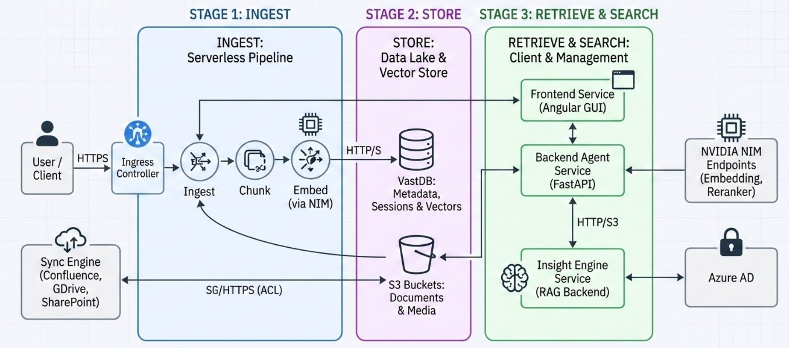

> # Go here for the latest version of [Research Assistant](https://github.com/vast-data/vast-research-assistant-agent)

# VAST DataEngine - Research Assistant Blueprint

An Enterprise RAG-Powered Research Assistant system powered by VAST DataEngine, using NVIDIA NIM's for LLM inference, embedding, and reranking.

This Blueprint was created to showcase the end-to-end utilization of the full VAST AI OS production-grade capabilities, including an Agentic Chat Interface, Serverless Event-based Document Ingestion, and VastDB as the unified Vector-Store for both document storage and conversation persistence.

## Overview

The system has two main parts:
1. **K8s Application** - Chat UI and Agent API (Kubernetes)
2. **InsightEngine Pipeline** - Serverless document ingestion (VAST DataEngine)



---

## Deployment

| Component | Guide |
|-----------|-------|
| **K8s Application** (Backend Agent, Frontend GUI) | [k8s-application](deployments/k8s-application/README.md) |
| **InsightEngine Pipeline** (Document Ingestion) | [insight-engine-pipeline](deployments/insight-engine-pipeline/README.md) |


---

## Key Features

| Feature | Description | Documentation |
|---------|-------------|---------------|
| **RAG Q&A** | Retrieval-augmented generation on document collections | [backend](source-code/backend/README.md) |
| **Streaming Responses** | Real-time token streaming with tool execution visibility | [backend](source-code/backend/README.md) |
| **Document Upload** | Single/multi-file and directory upload via GUI | [gui](source-code/gui/README.md) |
| **Collection Management** | Create and manage document collections | [gui](source-code/gui/README.md) |
| **Internet Search** | Optional DuckDuckGo web search augmentation | [backend](source-code/backend/README.md) |
| **Flexible LLM** | Works with local NVIDIA NIM or remote NVIDIA API | [backend](source-code/backend/README.md) |
| **Authentication** | JWT auth with optional Azure AD SSO | [k8s-application](deployments/k8s-application/README.md) |

---

## Component Documentation

| Component | Description |
|-----------|-------------|
| [backend](source-code/backend/README.md) | FastAPI agent service with RAG, streaming, session management |
| [gui](source-code/gui/README.md) | Angular chat UI with collection selector, citations, tool blocks |

---

## Pipeline Flow

```
Upload Document → S3 bucket
                      ↓
              InsightEngine Ingest
              (chunk, embed, store)
                      ↓
                 VastDB (vectors)
                      ↓
               Search Ready (RAG)
                      ↓
          Agent retrieves & answers
```

---

## Need Help?

- **K8s Deployment**: See [K8s Application Guide](deployments/k8s-application/README.md)
- **InsightEngine**: See [Pipeline Guide](deployments/insight-engine-pipeline/README.md)
- **Community**: [VAST Community Forums](https://community.vastdata.com/)
