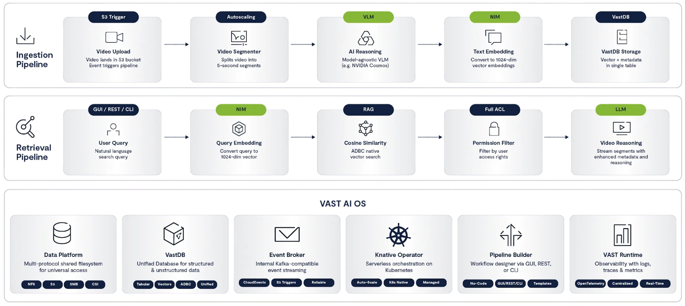

# VAST DataEngine - Video Reasoning Lab

Full overview: How to Deploy and Manage the Video Reasoning Lab system powered by VAST DataEngine.  

###### This is **NOT** an AI generated README. All steps here are mandatory to deploy the entire Demo.  

## Overview

The system has two main parts:
1. **Backend/Frontend** (Kubernetes) - User interface and API (fullstack frontend/backend application)
2. **Ingest Pipeline** (VAST DataEngine) - Serverless video processing functions

---

## Table of Contents

- [Overview](#overview)
- [Ingest / Retrieval Flow Breakdown](#ingest--retrieval-flow-breakdown)
- [Key Features](#key-features)
  - [Configurable Video Analysis Prompts (Cosmos VLM)](#1-configurable-video-analysis-prompts-cosmos-vlm)
  - [Dynamic Metadata Filters](#2-dynamic-metadata-filters)
  - [Advanced LLM & Search Settings (GUI)](#3-advanced-llm--search-settings-gui)
  - [Custom LLM System Prompt (GUI)](#4-custom-llm-system-prompt-gui)
  - [Time-Based Filtering](#5-time-based-filtering)
  - [Video Streaming Service](#6-video-streaming-service)
  - [User Authentication](#7-user-authentication)
- [Pipeline Flow Diagram](#pipeline-flow-diagram)
- [Prerequisites](#prerequisites)
- [Deployment Flow](#deployment-flow)
- [Part 1: Configuration](#part-1-configuration)
- [Part 2: Deploy Backend & Frontend](#part-2-deploy-backend--frontend)
- [Part 3: Deploy Ingest Pipeline Using DataEngine UI](#part-3-deploy-ingest-pipeline-using-dataengine-ui)
- [Part 4: Testing the Deployment](#part-4-testing-the-deployment)
- [Troubleshooting](#troubleshooting)
- [Environment Variables Summary](#environment-variables-summary)
- [Need Help?](#need-help)

---

## Ingest / Retrieval Flow Breakdown


---


## Key Features

### 1. Configurable Video Analysis Prompts (Cosmos VLM)

The `video-reasoner` function uses NVIDIA Cosmos VLM for video understanding. The analysis prompt can be configured per use case by setting the `scenario` key in the ingest secret, it is defaulted to `surveillance` for now.

**For complete documentation, see:** [ingest/video-reasoner/README.md#available-scenarios](ingest/video-reasoner/README.md#available-scenarios)

---

### 2. Dynamic Metadata Filters

The system supports customizable metadata fields that flow through the entire pipeline, enabling powerful filtering and organization of video content.

**For complete documentation, see:** [ingest/README.md#current-metadata-fields](ingest/README.md#current-metadata-fields)

---

### 3. Advanced LLM & Search Settings (GUI)

The GUI provides fine-grained control over search and LLM behavior via **Settings → Advanced LLM Settings**. Settings are persisted in browser localStorage and apply to all subsequent searches.

**For complete documentation, see:** [retrieval/video-backend/README.md#advanced-llm--search-settings-gui](retrieval/video-backend/README.md#advanced-llm--search-settings-gui)

---

### 4. Custom LLM System Prompt (GUI)

The LLM system prompt (used for synthesizing search results) can be customized via **Settings → System Prompt**. This allows tailoring the LLM response style without backend redeployment.

**For complete documentation, see:** [retrieval/video-backend/README.md#custom-llm-system-prompt-gui](retrieval/video-backend/README.md#custom-llm-system-prompt-gui)

---

### 5. Time-Based Filtering

Search results can be filtered by time using presets or custom date ranges. Time filter applies to `upload_timestamp` column in VastDB.

**For complete documentation, see:** [retrieval/video-backend/README.md#time-based-filtering](retrieval/video-backend/README.md#time-based-filtering)

---

### 6. Video Streaming Service

The **video-streaming** service is a REST API application that captures video streams (primarily YouTube) and automatically uploads segments to S3, which then triggers the ingest pipeline for processing. This Video Streaming to S3 is **Simulating** a realtime video streaming, and is used to demo the pipeline E2E.

**For complete documentation, see:** [video-streaming/README.md](video-streaming/README.md)

---

### 7. User Authentication

The system authenticates users against VAST cluster credentials with support for multiple tenants. Users authenticate using their VAST username and S3 secret key, which are validated against the VAST cluster.

**For complete documentation, see:** [retrieval/video-backend/README.md](retrieval/video-backend/README.md)

---

## Pipeline Flow Diagram



---

## Prerequisites

Before starting, ensure you have:

- **Kubernetes access:**
  - `kubectl` installed and configured for your remote cluster
  - `KUBECONFIG` environment variable set (or default config at `~/.kube/config`)
  - Ability to create namespaces and deploy resources

- **VAST cluster access:**
  - Access to VAST DataEngine UI / CLI
  - Cluster name (can be any arbitrary name you pick - e.g., `v1234`)
    - The cluster name can be application specific or arbitrary and will be used as part of the URL for accessing the application
  - Admin credentials for creating VMS manager user (see [User Authentication](retrieval/video-backend/README.md#user-authentication))

- **Storage resources:**
  - S3 buckets created: `video-chunks` and `video-chunks-segments`
  - VastDB database bucket created: `processed-videos-db` (or your custom name)

- **AI/ML services:**
  - NVIDIA COSMOS Modelo Endpoint (for video reasoning)
  - NVIDIA NIM Endpoints with API key (for embeddings and LLM models)

- **Network access:**
  - Your laptop/computer must be able to reach the remote Kubernetes cluster
  - Ability to modify `/etc/hosts` (or Windows hosts file) on your local machine

---

## Deployment Flow

Follow these steps in order:

1. **Part 1: Configuration** - Review and configure all secrets and images
2. **Part 2: Deploy Backend & Frontend** - Deploy Kubernetes services
3. **Part 3: Deploy Ingest Pipeline** - Create DataEngine pipeline using UI / CLI
4. **Part 4: Testing** - Test the complete system

---

## Part 1: Configuration

Before deploying, you need to configure secrets with your credentials. These secrets store sensitive information like API keys, database credentials, and S3 access keys.

### Step 1.1: Review and Configure Backend Secret

**Location:** `retrieval/k8s/backend-secret.yaml`

This file contains all the configuration needed for the backend service to connect to VastDB, S3, and NVIDIA services.

**Required configuration sections:**

1. **VastDB** (Database for storing video vectors):

   - `vdb_endpoint` - VastDB endpoint URL (from QueryEngine VIP pool)
      - Note for querying vectors, you will need a different endpoint than the `s3_endpoint`
   - `vdb_bucket` - Database bucket name (e.g., `processed-videos-db`)
   - `vdb_schema` - Database schema name (e.g., `processed-videos-schema`)
   - `vdb_collection` - Table/collection name (e.g., `processed-videos-collection`)
   - `vdb_access_key` - VastDB access key
   - `vdb_secret_key` - VastDB secret key

2. **S3** (Object storage for videos):
   - `s3_endpoint` - **CRITICAL**: S3 endpoint URL for your tenant (must match tenant users will authenticate with)
   - `s3_upload_bucket` - Bucket for uploaded videos (e.g., `video-chunks`)
   - `s3_segments_bucket` - Bucket for processed segments (e.g., `video-chunks-segments`)
   - `s3_access_key` - S3 access key
   - `s3_secret_key` - S3 secret key

3. **NVIDIA API** (AI/ML services):
   - `nvidia_api_key` - NVIDIA API key for NIM endpoints
   - `embedding_model` - Embedding model name (tested with `nvidia/nv-embedqa-e5-v5`)
   - `llm_model_name` - LLM model for synthesis (tested with `meta/llama-3.1-8b-instruct`)

4. **VAST Admin** (For user authentication):
   - `vast_admin_username` - VMS manager username (e.g., `vssadmin`)
   - `vast_admin_password` - VMS manager password
   - See [User Authentication Setup](retrieval/video-backend/README.md#setup-steps) for detailed instructions on creating the `vssadmin` user

**Edit the file with your credentials:**
```bash
cd retrieval/k8s
# Edit backend-secret.yaml with your configuration
vim backend-secret.yaml
# or use your preferred editor
```

### Step 1.2: Verify Docker Images

**Pre-built images (ready to use):**
- `vastdatasolutions/vde-video-backend:v1` - Backend API service
- `vastdatasolutions/vde-video-frontend:v1` - Frontend web UI
- `vastdatasolutions/vde-video-streaming:v1` - Video streaming capture service
- This step requires VMS access to add the container docker registry `https://hub.docker.com/u/` to the specific DataEngine tenant


These images are available on [Docker Hub](https://hub.docker.com/u/vastdatasolutions) and ready to use. The deployment YAML files reference these images by default.

**[OPTIONAL] If you need to use a different registry or rebuild images:**

**NOTE:** These are standard Docker containers for running the application (frontend/backend), they are not VAST DataEngine functions. They run as Kubernetes deployments.

```bash
# Example: Rebuild backend image
cd retrieval/video-backend
docker build -t <your-registry>/vde-video-backend:<tag> . --platform linux/amd64
docker push <your-registry>/vde-video-backend:<tag>
```

Then update the image references in:
- `backend-deployment.yaml` - Change `image:` field
- `frontend-deployment.yaml` - Change `image:` field  
- `videostreamer-deployment.yaml` - Change `image:` field

### Step 1.3: Review Ingest Secret

**Location:** `ingest/vde-video-ingest-secret-template.yaml`

**Required configuration:**
- **S3**: Upload bucket credentials
- **Cosmos**: AI model server credentials (host, port, username, password)
- **NVIDIA NIM**: Embedding model API keys
- **VastDB**: Database credentials
- **Video Processing**: Segment duration, codec, format
- **Scenario**: Video analysis prompt scenario (default: `surveillance`) - See [Configurable Video Analysis Prompts](ingest/video-reasoner/README.md) for available scenarios and customization

**Edit the file with your credentials:**
```bash
# Edit ingest secret
vim ingest/vde-video-ingest-secret-template.yaml
```

---

## Part 2: Deploy Backend & Frontend

Now that all configuration is ready, deploy the backend and frontend services to Kubernetes.

### What Gets Deployed

The deployment creates:
- **Backend Service** (FastAPI) - REST API for search, authentication, video management (see [video-backend/README.md](retrieval/video-backend/README.md))
- **Frontend Service** (Angular) - Web UI for video search and upload (see [video-frontend/README.md](retrieval/video-frontend/README.md))
- **Video Streaming Service** - Service for capturing live video streams (see [video-streaming/README.md](video-streaming/README.md))
- **Ingress Resources** - Exposes services via HTTP with custom domain names
- **Secrets & ConfigMaps** - Stores credentials and configuration

### Deployment Steps

1. **Navigate to the k8s directory:**
```bash
cd retrieval/k8s
```

2. **Run the deployment script with NAMESPACE and CLUSTER_NAME:**
```bash
./QUICK_DEPLOY.sh <namespace> <cluster_name>
```

**Example:**
```bash
./QUICK_DEPLOY.sh vastvideo v1234
```
Replace `v1234` with your actual cluster name. This value will be used as part of the URL to accessing the frontend application.


**Parameters:**
   - `<namespace>` - Kubernetes namespace where resources will be deployed (e.g., `vastvideo`)
   - `<cluster_name>` - Cluster name used for ingress hostnames (e.g., `v1234`)

**Note:** Both parameters are required. The script will fail if either is missing.

**What the script does:**
   - Validates that both namespace and cluster_name parameters are provided
   - Checks prerequisites (kubectl, cluster connectivity)
   - Creates the specified namespace
   - Deploys backend secret (credentials & config from `backend-secret.yaml`)
   - Deploys backend service (FastAPI)
   - Deploys frontend service (Angular)
   - Deploys video streaming service
   - Creates ingress rules for external access
   - All resources are deployed to the specified namespace

**Note:** LLM system prompt is now configured via the GUI settings (no ConfigMap needed).

4. **Wait for pods to be ready:**
```bash
kubectl get pods -n <namespace> -w
```

Replace `<namespace>` with the namespace you specified in step 2.

5. **Configure DNS on your local machine:**

Get the Ingress IP and add it to your `/etc/hosts` file (on your laptop, not the remote cluster):

```bash
# Get the Ingress IP
kubectl get ingress -n <namespace>
# Look for EXTERNAL-IP or ADDRESS (may show "pending" initially - wait a few minutes)
```

Replace `<namespace>` with the namespace you specified in step 2.

Add one of the listed IPs to `/etc/hosts` (macOS/Linux) or `C:\Windows\System32\drivers\etc\hosts` (Windows):
```
<INGRESS_IP> video-lab.<cluster_name>.vastdata.com
```

**Note:** Each user needs to add this entry on their own machine to access the UI.

6. **Access the UI:**
```
http://video-lab.<cluster_name>.vastdata.com
```

---

## Part 3: Deploy Ingest Pipeline Using DataEngine UI

Now that you've configured the ingest secret (Step 1.3), deploy the serverless video processing pipeline using the **VAST DataEngine UI**.

### Pipeline Overview (Just an Overview - Read It - NOT a deployment yet.)

**Pipeline Name:** `video-realtime-processing-pipeline`

The pipeline has 2 trigger-to-function flows:

#### Flow 1: Video Segmentation
```
video-chunk-land-trigger → video-segmenter
```
- **Trigger**: S3 bucket `video-chunks` (when video is uploaded)
- **Function**: [video-segmenter](ingest/video-segmenter/README.md) - Splits videos into segments

#### Flow 2: Video Analysis & Storage
```
video-segment-land-trigger → video-reasoner → video-embedder → video-vastdb-writer
```
- **Trigger**: S3 bucket `video-chunks-segments` (when segment is created)
- **Functions**: 
  - [video-reasoner](ingest/video-reasoner/README.md) - Analyzes video content with AI
  - [video-embedder](ingest/video-embedder/README.md) - Converts reasoning to embeddings
  - [video-vastdb-writer](ingest/vastdb-writer/README.md) - Stores vectors in VastDB

---

### Step 3.1: Create Triggers

##### Prerequisites:
- This step assumes you have a running Vast DataEngine cluster
- You have a user with the right permissions and roles to setup DataEngine Pipelines (Including the Vector QueryEngine Identity-Policy.)
- You have a pre-created Topic in Vast Event Broker (e.g. video-topic) for creating triggers
   - It is recommended to create a new Topic and not use the default Topic, which is used by the DataEngine cluster itself

Navigate to **DataEngine UI** → **Triggers** and create:

| Trigger Name | Type | Configuration |
|--------------|------|---------------|
| `video-chunk-land-trigger` | S3 Bucket | Bucket: `video-chunks` |
| `video-segment-land-trigger` | S3 Bucket | Bucket: `video-chunks-segments` |

---

### Step 3.2: Create Functions

Navigate to **DataEngine UI** → **Functions** and create:

| Function Name | Public Image | Documentation |
|---------------|-----------------|---------------|
| `video-segmenter` | `vastdatasolutions/vde-video-segmenter:v1` | [video-segmenter/README.md](ingest/video-segmenter/README.md) |
| `video-reasoner` | `vastdatasolutions/vde-video-reasoner:v1` | [video-reasoner/README.md](ingest/video-reasoner/README.md) |
| `video-embedder` | `vastdatasolutions/vde-video-embedder:v1` | [video-embedder/README.md](ingest/video-embedder/README.md) |
| `video-vastdb-writer` | `vastdatasolutions/vde-vastdb-writer:v1` | [vastdb-writer/README.md](ingest/vastdb-writer/README.md) |

**Note:** Docker images are prebuilt and available on Docker Hub. If you need to push to a different registry, rebuild the images:
```bash
cd ingest/<function-folder>
vastde build -t <your-registry>/<image-name>:<tag> . --platform linux/amd64
docker push <your-registry>/<image-name>:<tag>
```
Then use your custom image in the DataEngine UI function creation.

---

### Step 3.3: Create Pipeline

Navigate to **DataEngine UI** → **Pipelines** → **Create New Pipeline**

**Pipeline Name:** `video-realtime-processing-pipeline`

Upload **ingest secret** configured in Part 1: `ingest/vde-video-ingest-secret-template.yaml`

**Add the following connections:**

1. **Segmentation Flow:**
   - Connect: `video-chunk-land-trigger` → `video-segmenter`

2. **Analysis Flow:**
   - Connect: `video-segment-land-trigger` → `video-reasoner`
   - Connect: `video-reasoner` → `video-embedder`
   - Connect: `video-embedder` → `video-vastdb-writer`

3. **Raise CPU / MEM Resources to All functions:**
   - CPU: `1000m - 5000m`
   - Memory: `1280Mi - 2560Mi`

**Save and activate the pipelines.**

---

## Part 4: Testing the Deployment

Now that everything is deployed, test the complete system end-to-end.

### Testing Steps

1. **Login to the GUI:**
   - Open `http://video-lab.<cluster_name>.vastdata.com` in your browser (replace `<cluster_name>` with the cluster name you used during deployment)
   - Enter your authentication credentials (see [User Authentication](retrieval/video-backend/README.md#how-authentication-works) for details)
   - Click "Log in"

2. **Upload a test video:**
   - Click "Upload Video"
   - Drag & drop a video file
   - Video is uploaded to S3 bucket `video-chunks`

3. **Monitor the pipeline (DataEngine UI):**
   - Open **DataEngine UI** → **Pipelines** - Status should be **Running**
   - Watch the pipeline process your video through all functions
   - Click on any execution to see detailed logs
   - Verify all functions complete successfully

4. **Verify data in VastDB:**
   - Check that vectors and metadata are stored in the `processed-videos-collection` table

5. **Search for content:**
   - Return to the Video Lab GUI
   - Use the search bar
   - Try example queries like "person walking"
   - Enable "LLM Reasoning" toggle
   - View video segments with AI-generated summaries

---

## Troubleshooting

### Common Issues

**1. Cannot access the web UI:**
- Verify pods are running: `kubectl get pods -n <namespace>` (replace with your namespace)
- Check ingress IP: `kubectl get ingress -n <namespace>` (replace with your namespace)
- Verify `/etc/hosts` entry on your local machine (not on cluster)
- Try accessing by IP directly: `http://<INGRESS_IP>`

**2. Authentication fails:**
- See [Authentication Troubleshooting](retrieval/video-backend/README.md#troubleshooting) in the backend documentation for detailed steps

**3. Search returns no results:**
- Check if videos have been processed (DataEngine UI → Executions)
- Verify VastDB connection in backend secret
- Check NVIDIA API key is valid
- Review backend logs for embedding/search errors

**4. Videos not processing:**
- Verify pipeline is Active in DataEngine UI
- Check S3 bucket names match in ingest secret
- Review function logs in DataEngine UI → Executions
- Verify Cosmos VLM endpoint is accessible

### View Logs

**Backend/Frontend:**
```bash
# Backend logs (replace <namespace> with your namespace)
kubectl logs -f -n <namespace> -l app=video-backend

# Frontend logs
kubectl logs -f -n <namespace> -l app=video-frontend

# Video streaming service logs
kubectl logs -f -n <namespace> -l app=video-stream-capture
```

**Ingest Functions (DataEngine UI):**
- Navigate to **DataEngine UI** → **Pipelines** → Click on pipeline → **Pipeline Logs** → View logs for each function 

---

## Environment Variables Summary

### Backend Secret Contains:
- `vdb_endpoint` - VastDB endpoint URL
- `vdb_bucket` - Database bucket name
- `vdb_schema` - Database schema name
- `vdb_collection` - Table name for video segments
- `s3_endpoint` - S3 endpoint URL
- `s3_upload_bucket` - Bucket for video uploads
- `s3_segments_bucket` - Bucket for processed segments
- `nvidia_api_key` - NVIDIA NIM API key
- `embedding_model` - Embedding model name
- `llm_model_name` - LLM model for synthesis

### Ingest Secret Contains:
- `s3accesskey` / `s3secretkey` - S3 credentials
- `cosmos_host` - Cosmos VLM server IP
- `cosmos_username` / `cosmos_password` - Cosmos credentials
- `embeddinghost` - NVIDIA NIM endpoint
- `vdbendpoint` - VastDB endpoint
- `vdbcollection` - Target collection for storage
- `segment_duration` - Video segment length (seconds)

---

## Need Help?

- **Backend/Frontend issues**: Check Kubernetes pod logs
- **Pipeline issues**: Use DataEngine UI → Executions to see where pipeline fails
- **Function errors**: Check function logs in DataEngine UI
- **Database issues**: Verify VastDB connectivity and credentials in secrets
- **Search not working**: Check NVIDIA API key in backend secret
- **Videos not processing**: Verify pipeline is Active in DataEngine UI and S3 buckets are correct
---

- **COSMOS Community**: Reach out to us on our [Community forums](https://community.vastdata.com/) for additional help!

